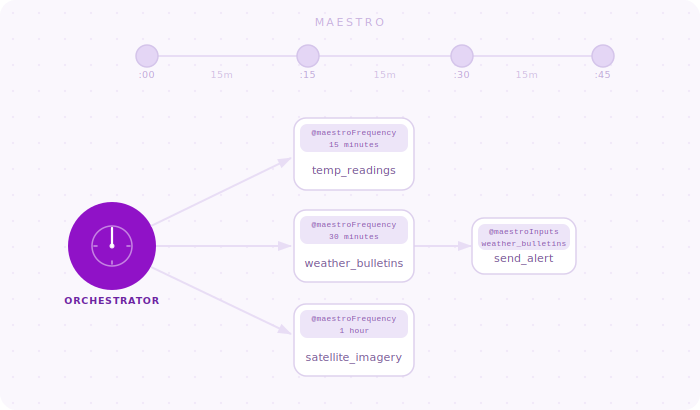

<!-- README.md is generated from README.Rmd. Please edit that file -->

```{r, include = FALSE, cache = FALSE}
#| echo: false
knitr::opts_chunk$set(
  fig.path = "man/figures/README-",
  out.width = "100%"
)
asciicast::init_knitr_engine(
  echo = TRUE,
  echo_input = FALSE
)
options(asciicast_theme = "pkgdown")
```

# maestro <a href="https://whipson.github.io/maestro/"></a>

<!-- badges: start -->

[](https://github.com/whipson/maestro/actions/workflows/R-CMD-check.yaml) 
[](https://app.codecov.io/gh/whipson/maestro?branch=main)
[](https://cran.r-project.org/package=maestro)
[](https://CRAN.R-project.org/package=maestro)
[](https://cran.r-project.org/package=maestro)
<!-- badges: end -->

`maestro` is a lightweight framework for creating and orchestrating data pipelines in R. At its core, maestro is an R script scheduler that is unique in two ways:

1.  Stateless: It does not need to be continuously running - it can be run in a serverless architecture
2.  Use of *rounded scheduling*: The timeliness of pipeline executions depends on how often you run your orchestrator

In `maestro` you create **pipelines** (functions) and schedule them using `roxygen2` tags - these are special comments (decorators) above each function. Then you create an **orchestrator** containing `maestro` functions for scheduling and invoking the pipelines.

## Installation

`maestro` is available on CRAN and can be installed via:

```r
install.packages("maestro")
```
Or, try out the development version via:

``` r
devtools::install_github("https://github.com/whipson/maestro")
```

## Big Picture

`maestro` is a framework for orchestrating multiple pipelines. The picture below imagines multiple weather-based ingestion pipelines, managed by a single orchestrator.



## Project Setup

A `maestro` project needs at least two components:

1.  A collection of R pipelines (functions) that you want to schedule
2.  A single orchestrator script that kicks off the scripts when they're scheduled to run

The project file structure will look something like this:

```         
sample_project
├── orchestrator.R
└── pipelines
    ├── satellite_imagery.R
    ├── temp_readings.R
    └── weather_bulletins.R
```

Use `maestro::create_maestro()` to easily create this project structure in a blank R project.

### Orchestrator

The orchestrator is a script that checks the schedules of all the pipelines in a `maestro` project and executes them. The orchestrator also handles global execution tasks such as collecting logs and managing shared resources like global objects and custom functions.

You have the option of using Quarto, RMarkdown, or a straight-up R script for the orchestrator, but the former two have some advantages with respect to deployment on Posit Connect.

A simple orchestrator looks like this:

```{asciicast}
library(maestro)

schedule <- build_schedule()

output <- run_schedule(
  schedule, 
  orch_frequency = "15 minutes",
  n_show_next = 0
)
```

The function `build_schedule()` scours through all the pipelines in the project and builds a schedule. Then `run_schedule()` checks each pipeline's scheduled time against the system time within some margin of rounding and calls those pipelines to run.

### Pipelines

A pipeline is task we want to run. This task may involve retrieving data from a source, performing cleaning and computation on the data, then sending it to a destination. `maestro` is not concerned with what your pipeline does, but rather *when* you want to run it. Here's a simple pipeline in `maestro`:

```{r}
#' Example ETL pipeline
#' @maestroFrequency daily
#' @maestroStartTime 12:30:00
my_etl <- function() {
  
  # Pretend we're getting data from a source
  message("Get data")
  extracted <- mtcars
  
  # Transform
  message("Transforming")
  transformed <- extracted |> 
    dplyr::mutate(hp_deviation = hp - mean(hp))
  
  # Load - write to a location
  message("Writing")
  # write.csv(transformed, file = paste0("transformed_mtcars_", Sys.Date(), ".csv"))
}
```

What makes this a `maestro` pipeline is the use of special *roxygen*-style comments above the function definition:

-   `#' @maestroFrequency daily` indicates that this function should execute at a daily frequency.

-   `#' @maestroStartTime 12:30:00` indicates that it runs at 12:30.

In other words, we'd expect it to run every day at 12:30. There are more `maestro` tags than these ones and all follow the camelCase convention established by `roxygen2`.
